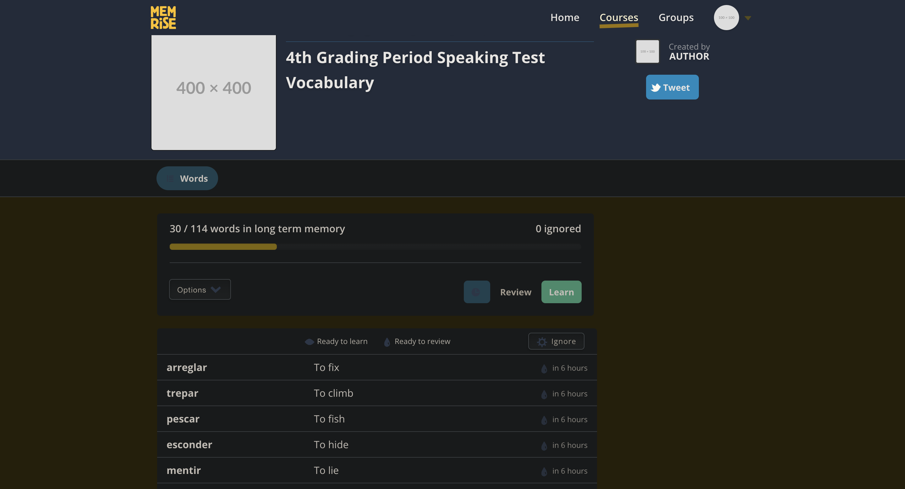
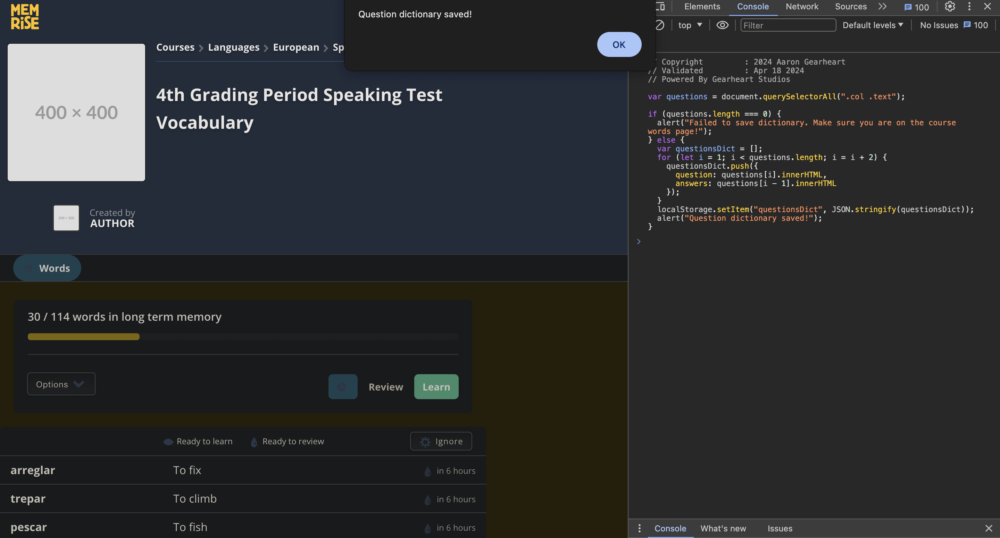
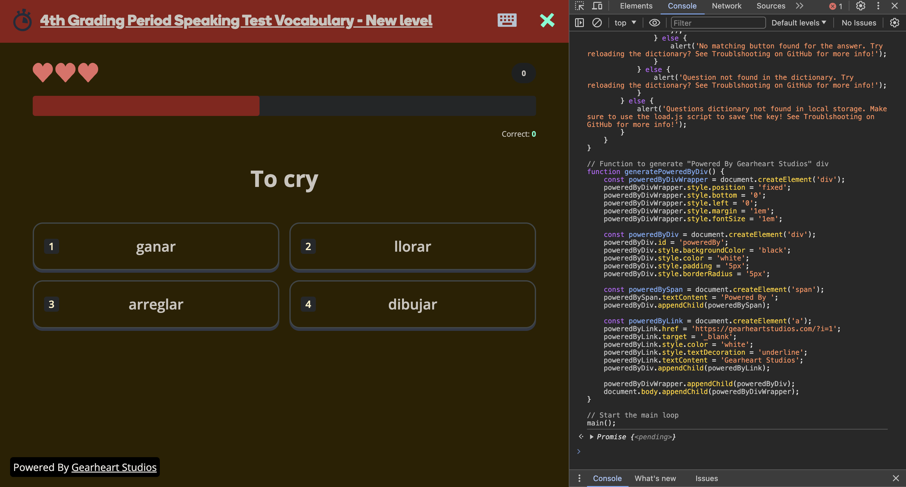
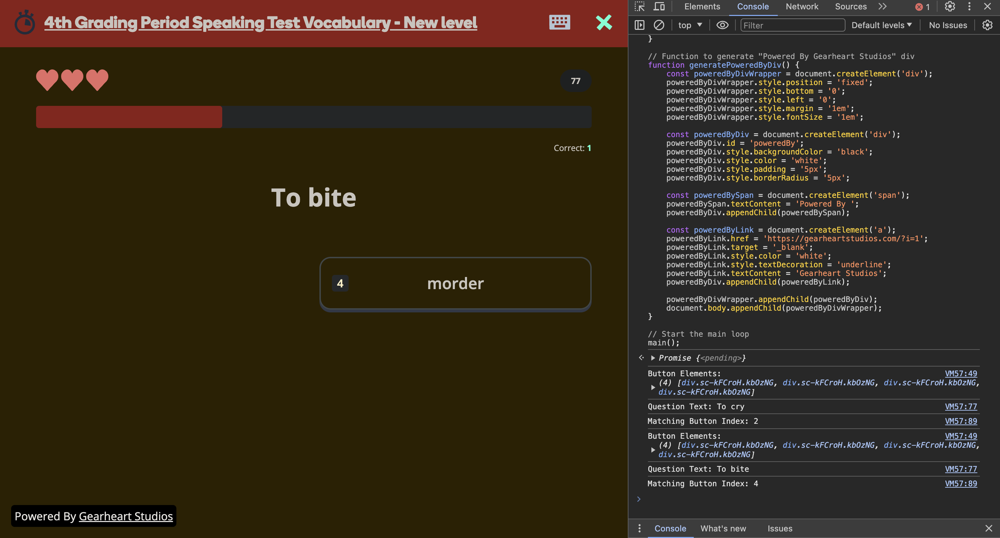

# Memrise Point Hack
### **⚠️DISCLAIMER!⚠️** These scripts are designed purely for educational purposes and if used to cheat in school could get you in serious trouble. I do not condone cheating this is made to test the capability of JS. USE AT YOUR OWN DISCRETION
## How To Setup
**If you can't enter the inspect panel you need to make the JS a bookmarklet generator such as [this one](https://caiorss.github.io/bookmarklet-maker/) made by [caiross](https://github.com/caiorss) to run it**
1. Login to your Memrise course. As of Apr. 18, 2024 community courses have moved so this may be in a new location. Navigate to the course overview where you can see the list of words. 

> This may look different from yours as some elements have been changed for my privacy.
2. Paste the [load.js](load.js) file contents into the Chrome console. You can open the chrome console with F12 or by right-clicking and choosing inspect. From here choose Console and paste the [load.js](load.js) file content into it.

> You should see an alert saying "Question dictionary saved!" If you don't see this, go to the [troubleshooting](#troubleshooting) section.
3. Copy the contents of [main.js](main.js) and then, with the Chrome console still open, click on speed review and paste the code into the console.

4. Now everytime you hit the space bar it will delete all the incorrect answers making it easy to select the right answer and grind points.

> If you recieve an error when you hit the space bar, go to the [troubleshooting](#troubleshooting) section.
5. Enjoy 🎉

# Troubleshooting
**If you get an error when using load.js you may be on the wrong webpage or the structure of the page may have changed patching this method. Terribly sorry but there isn't much I can do about this but if you make a Github issue I will try to patch this or another user may make a pull request to fix it.** 

**If you had an error when using main.js (aka hitting space bar) then any number of things could be wrong.**
1. You got the "No matching button" in which case you might need to do the load.js step again or load.js failed and didnt throw an error meaning the sites structure changed patching this script. Regrettably I can't account for possible future changes so add a Github issue and someone (me included) may fix the issue.
2. You got the "Question not found in dictionary" in which case you may have done the load.js script on a different course than the speed review is on. Try redoing the load.js step.
3. You got the "Question dictionary not found in local storage" in which case load.js failed and probably gave you an error or the storage has cleared. Redo the load.js step and it should fix this issue.
4. You hit space and nothing happened. This could happen for a myriad of reasons. Make sure you pasted the script **EXACTLY** as in the main.js file and pressed enter. You should see black rectangle that says "Powered By Gearheart Studios" in it indicating it has worked correctly.
5. None of the above worked or none of the above applied. I have no idea at this point because so many things could go wrong and in this case make a Github issue and I will try to look into it or another user may do so. Sorry for the inconvenience but sometimes websites change.
# Contributing
If you have experience with JS and HTML feel free to make a pull request especially if you are fixing an issue caused by the website changing.
Your contribution is much appreciated!
## Contributors
[AaronGearheart](https://github.com/AaronGearheart)
